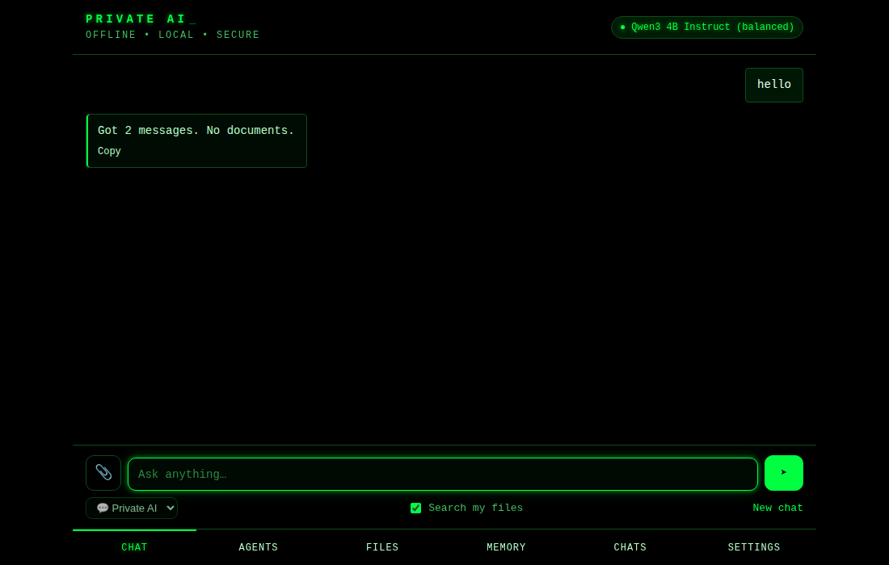

# Private AI: a portable, offline AI drive

Plug in a USB drive, double-click **Start**, and a private assistant opens in
your browser. It runs on the host computer's CPU or GPU with
[llama.cpp](https://github.com/ggml-org/llama.cpp). It can read your PDFs and
documents, and it remembers what you ask it to. All of it stays on the drive,
encrypted. No internet, account, subscription or API key is needed.

> Portable AI for Windows, macOS, and Linux. No cloud. No subscription.
> Your conversations and files remain on your device.



## Drive layout

```
PRIVATE-AI/                         (exFAT, 64 GB+)
├── Start-Windows.bat               launchers: pick the right binary for the OS/CPU
├── Start-macOS.command
├── start-linux.sh
├── config.json                     models, port, GPU layers, system prompt
├── bin/<os>-<arch>/privateai       the app (one ~7 MB static Go binary per platform)
├── runtime/                        llama.cpp llama-server builds
│   ├── windows-x64-cuda | -vulkan | -cpu,  windows-arm64-cpu
│   ├── macos-arm64 (Metal) | macos-x64
│   └── linux-x64-vulkan | -cpu,  linux-arm64-cpu
├── models/
│   ├── chat/                       general assistant GGUF models (~1–5 GB each)
│   ├── embed/                      embedding model for document search (<200 MB)
│   └── specialist/                 optional extra models
└── data/
    ├── settings.json               non-secret preferences (chosen model)
    └── vault/                      encrypted chats, memory, documents, search index
```

Typical 64 GB budget: models 5–15 GB, runtimes about 1.5 GB for all platforms,
app under 50 MB, and the rest for your documents, index and free space.

## How it works

1. **Launcher**: `Start-*` runs `bin/<os>-<arch>/privateai`. The app finds the
   drive root by looking for `config.json`.
2. **Hardware detection**: OS, CPU architecture, RAM, and NVIDIA (CUDA),
   Vulkan or Apple Silicon (Metal) support.
3. **Runtime fallback**: it tries `runtime/<platform>-cuda`, then `-vulkan`,
   then `-cpu`. A runtime that fails to load the model is skipped, so CPU is
   always the universal fallback.
4. **Model choice**: it uses the first chat model in `config.json` that is on
   the drive and fits in RAM. You can switch models in Settings.
5. **Two local `llama-server` processes** run on `127.0.0.1` with random
   ports: one for chat and one for embeddings.
6. **Web UI** at `http://127.0.0.1:8740`, embedded in the binary.

### Privacy and security

| | |
|---|---|
| Network | Every server binds to `127.0.0.1` only, and API requests from non-loopback addresses are refused. Nothing calls out. |
| Other websites | Host-header check (blocks DNS rebinding), and every write request needs a custom header (blocks CSRF). Strict CSP. |
| Data at rest | `data/vault`: AES-256-GCM. The key comes from your passphrase (PBKDF2-SHA256, 600k iterations, random salt). Object names are HMAC'd, so file names reveal nothing. Each object is bound to its name, so swapping files is detected. |
| Locking | The key lives only in RAM. **Lock** or **Shut down** discards it. |
| Host computer | Nothing is written outside the drive and logs go only to the console window, unless you turn on **Faster loading** (off by default). That copies only public model files, named by checksum, to the computer's cache folder (`~/Library/Caches/PrivateAI` on macOS, at most 40 GB). It never copies chats, documents or memory, and **Remove cached models** deletes them. |
| Uploaded HTML/SVG | Served back as plain text, so it cannot run script in the app's origin. |

Forgetting the passphrase makes the vault unrecoverable. That is deliberate.

### Documents (local RAG)

- Text is extracted in-process from PDF, DOCX, TXT/MD, CSV/TSV, JSON, HTML, XML and RTF.
- Text is split into chunks of about 1200 characters with overlap, then embedded locally.
- Search is hybrid: BM25 keyword ranking fused with embedding cosine
  similarity (reciprocal rank fusion). Without an embedding model it falls
  back to keyword search, and documents added meanwhile are embedded later.
- **Ask about a file**: drop it on the chat, or press *Ask* in Files. If the
  whole document fits in the context window, the model reads all of it. That
  matters for "summarize this contract". Otherwise it gets the most relevant
  excerpts. Sources are shown under each answer.

### Screenshots and images

Paste a screenshot into the chat (⌘V / Ctrl+V), drop an image on it, or use 📎.
The browser shrinks it to 1280 px before sending, which keeps text readable
and cuts processing time about 3–4×. Images are stored encrypted in the vault
with the chat.

Reading images needs a **vision model**: a chat model with a matching image
projector (`mmproj`) file. The default is Qwen3-VL 4B, with Qwen3-VL 2B for
low-memory computers. If the active model can't see images, the chat offers
to switch.

### Image reader (two models at once)

If the chat model can't see images, for example Qwen3 14B or DeepSeek R1, a
second, smaller vision model can run alongside it as the **image reader**. It
describes each pasted image, transcribing all the text, and the chat model
answers from that description, so agents and tools keep using the stronger
model. Descriptions are saved with the chat, so follow-up questions about the
image keep working.

It turns on automatically on computers with 16 GB or more of memory, using the
smallest vision model on the drive. Change or turn it off under **Settings →
Image reader**.

### Faster loading (model cache)

Load time is mostly the drive reading the model file, which can be 7–9 GB.
With **Settings → Faster loading** on, each model is copied to the computer's
internal disk after its first load, with the copy verified against the model's
SHA-256. Later loads read from that copy, which is typically several times
faster than a USB stick. The copy only starts once the model is loaded and
running, never while it is still loading. It keeps 10 GB of the computer's
disk free and removes the least recently used models when it reaches 40 GB.

### Agents

The **Agents** tab creates assistants with their own:

- **instructions**: their role, focus and answer format
- **tools**: search documents, read a document, list documents, calculator,
  date & time, remember a fact, create a note (saved to Files)
- **documents**: all files, selected files, or none
- **creativity**: the model's temperature setting

Pick an agent from the menu under the chat box, or start from a template:
Research Assistant, Contract Reviewer, Note Taker, Math Tutor, Writing Coach.
Agents use llama.cpp's tool calling. The model may call tools for up to 6
rounds before it must answer, and each answer shows the tools it used.

Tools run in-process. They can't reach the internet, run programs, or touch
the host computer's files. The most an agent can change is adding a note or a
memory to your own vault. Agents and their chats are encrypted like
everything else.

## Building a drive

You need Go 1.24 or newer.

```sh
make test              # unit tests + end-to-end test against a fake llama-server
make drive             # cross-compile all 6 targets into dist/PRIVATE-AI
make drive-full        # also download llama.cpp runtimes + models from config.json (several GB)
```

Or step by step:

```sh
scripts/build-drive.sh
go run ./cmd/drivetool fetch-runtime -drive dist/PRIVATE-AI            # optionally -tag b6500 -only linux-x64-cpu
go run ./cmd/drivetool fetch-models  -drive dist/PRIVATE-AI -only qwen3-4b,nomic-embed
go run ./cmd/drivetool check         -drive dist/PRIVATE-AI
go run ./cmd/drivetool verify        -drive /Volumes/USBAI   # after copying: checks every model's size + SHA-256
```

Then format the USB drive as **exFAT**, which Windows, macOS and Linux can all
read and write. Copy the contents of `dist/PRIVATE-AI` to its root.

`drivetool fetch-runtime` matches llama.cpp GitHub release assets by name and
keeps only `llama-server` and its shared libraries. It also dereferences
symlinks, because exFAT cannot store them. If the GitHub API is blocked or
rate-limited, it lists `bNNNN` tags with `git ls-remote` and probes
the known asset names directly. All runtimes come to about 1.7 GB, about 1.2 GB
of which is the Windows CUDA build. If upstream renames its assets, update
`runtimeAssets` and `probeAssets` in `cmd/drivetool/main.go`.

By default it installs the newest numbered `bNNNN` build whose release has
every runtime. GitHub's "latest" llama.cpp release can be a `vX.Y.Z`
release with no prebuilt binaries, and the newest build may still be
uploading its files. Pass `-tag bNNNN` to pin a specific build.

Last verified against llama.cpp b11332: all 9 runtimes downloaded. A real
end-to-end run on Linux x64 (Qwen3 1.7B + nomic-embed) answered questions
about an uploaded contract with correct citations.

### Default models

Licenses: Qwen and DeepSeek are Apache-2.0 / MIT. Gemma uses Google's Gemma
terms. Full DeepSeek R1/V3 (671B parameters, about 400 GB) is too large for a
laptop; the R1 distill below is the version that runs locally.

| id | model | size | RAM |
|---|---|---|---|
| `qwen3-14b` | Qwen3 14B Q4_K_M, best quality and the default at 16 GB+ | ~9.0 GB | 16 GB+ |
| `qwen3-8b` | Qwen3 8B Q4_K_M | ~5 GB | 16 GB+ |
| `qwen3-vl-4b` | Qwen3-VL 4B Instruct Q4_K_M + mmproj Q8_0, **sees images** | ~2.9 GB | 8 GB+ |
| `qwen3-4b` | Qwen3 4B Instruct 2507 Q4_K_M | ~2.5 GB | 8 GB+ |
| `qwen3-vl-2b` | Qwen3-VL 2B Instruct Q4_K_M + mmproj Q8_0, **sees images** | ~1.5 GB | 4 GB+ |
| `gemma3-12b` | Gemma 3 12B Q4_K_M + mmproj F16, **sees images**, sharpest image reading | ~8.2 GB | 16 GB+ |
| `deepseek-r1-8b` | DeepSeek R1 0528 (Qwen3 8B distill), reasons step by step; slow, and in testing it reasoned its way to a wrong answer on simple arithmetic, so treat it as optional | ~5.0 GB | 12 GB+ |
| `qwen3-1.7b` | Qwen3 1.7B Q4_K_M | ~1.1 GB | 4 GB+ |
| `nomic-embed` | nomic-embed-text v1.5 Q8_0 | ~140 MB | — |

To use any other GGUF model, add an entry to `config.json`. For a vision
model, also set `mmproj` and `mmproj_url`. When `build-drive.sh` runs on an
existing drive, it calls `drivetool sync-config`, which adds models introduced
by updates and keeps your other settings.

### Damaged or incomplete model files

`config.json` records each model's exact size and SHA-256, taken from
Hugging Face. At startup, Private AI skips any model file whose size is wrong,
which is usually a copy to the drive that was cut short. If a model fails to
load, it falls back to the next model that works and shows why in a yellow
notice. To check every model on a drive, run `drivetool verify`, which can
take a few minutes over USB.

## Known limits

- **Not every computer works.** Locked-down corporate or school machines often
  block programs on removable media. Computers with very little RAM cannot run
  the models.
- **macOS Gatekeeper**: the binaries are unsigned. The launcher clears the
  quarantine flag, but the first launch may still need right-click → Open.
  Signing and notarizing is a to-do for a product release.
- **Linux `noexec` mounts**: some desktops mount USB drives without exec
  permission. The launcher detects this and tells you how to remount.
- Scanned PDFs need OCR, which is not included yet.
- USB 2.0 drives make model loading slow. USB 3 is strongly recommended.
- If the console window is closed instead of using *Shut down*, the
  `llama-server` child processes may keep running on Windows until logout.

## Code map

| path | what |
|---|---|
| `cmd/privateai` | launcher/server entry point |
| `cmd/drivetool` | builds drives: fetches runtimes and models, checks the layout |
| `internal/platform` | OS/arch/RAM/GPU detection, runtime candidates |
| `internal/llama` | starts `llama-server`, streams chat, gets embeddings |
| `internal/vault` | encrypted object store |
| `internal/rag` | text extraction, chunking, hybrid index |
| `internal/app` | app state, chat orchestration, agents and tools, images, HTTP API |
| `web/static` | the UI (vanilla HTML/CSS/JS, embedded) |
| `launchers/`, `drive/` | files copied to the drive root |
